# Documentation Complète - WhatsApp Campaign Automation Platform (WCAP)
## Avec Intégration Wati.io

---

# 1. PRD - Product Requirements Document (Mis à jour)

## 1.1 Vue d'ensemble du Projet

**Nom du Projet:** WhatsApp Campaign Automation Platform (WCAP)  
**Version:** 2.0  
**Date:** Août 2025  
**Devise:** XAF (Franc CFA)  
**Langue:** Interface Française  
**Solution WhatsApp:** Wati.io API

## 1.2 Vision & Objectifs

### Problématique
Les organisations comme la CNSA font face à des défis majeurs :
- Processus entièrement manuels via WhatsApp Web
- Blocages fréquents des comptes
- Gestion inefficace des contacts
- Absence d'automatisation des interactions
- Scalabilité limitée pour 70,000+ contacts

### Solution avec Wati.io
Développer une plateforme SaaS complète qui exploite Wati.io pour :
- **Broadcasts automatisés** via l'API Wati.io
- **Chatbot intégré** avec flow builder Wati.io
- **Gestion intelligente** des contacts et segments
- **Analytics avancés** combinant Wati.io et données personnalisées
- **Multi-agents** pour support humain quand nécessaire

## 1.3 Fonctionnalités Principales avec Wati.io

### Module 1: Gestion des Contacts
- Import/Export via CSV avec synchronisation Wati.io
- Segmentation avancée avec tags Wati.io
- Attributs personnalisés illimités
- Historique complet des interactions

### Module 2: Broadcasts Intelligents
- Templates WhatsApp approuvés via Wati.io
- Personnalisation avec variables dynamiques
- Planification avancée
- Gestion automatique des limites de taux

### Module 3: Chatbot Wati.io
- Flow Builder visuel
- NLP intégré pour le français
- Escalade intelligente vers agents humains
- Intégration avec base de connaissances

### Module 4: Analytics & Reporting
- Dashboard temps réel Wati.io
- Métriques personnalisées
- Export des données
- Rapports automatisés

## 1.4 Modèle de Tarification

| Plan | Prix (XAF/mois) | Contacts | Messages | Agents Wati.io |
|------|-----------------|----------|----------|----------------|
| Starter | 75,000 | 5,000 | 10,000 | 2 |
| Professional | 200,000 | 25,000 | 50,000 | 5 |
| Enterprise | 450,000 | 100,000+ | Illimité | 10+ |

---

# 2. Architecture Technique avec Wati.io

## 2.1 Stack Technologique Mis à Jour

### Frontend
```javascript
{
  "framework": "React 18.3 + TypeScript",
  "ui": "Tailwind CSS + Shadcn/ui",
  "state": "Zustand + TanStack Query",
  "routing": "React Router v6",
  "forms": "React Hook Form + Zod",
  "charts": "Recharts",
  "builder": "Vite"
}
```

### Backend & Intégrations
```javascript
{
  "database": "Supabase (PostgreSQL)",
  "auth": "Supabase Auth",
  "storage": "Supabase Storage",
  "whatsapp": "Wati.io API",
  "functions": "Supabase Edge Functions",
  "payments": "Flutterwave (XAF)",
  "realtime": "Supabase Realtime + Wati.io Webhooks"
}
```

## 2.2 Architecture Wati.io

### Configuration API
```javascript
// Configuration Wati.io
const WATI_CONFIG = {
  baseURL: 'https://api.wati.io/v1',
  apiKey: process.env.WATI_API_KEY,
  webhookURL: process.env.SUPABASE_URL + '/functions/v1/wati-webhook',
  accountId: process.env.WATI_ACCOUNT_ID
};
```

### Endpoints Principaux Wati.io
```javascript
// Services Wati.io à intégrer
const WATI_SERVICES = {
  // Contacts
  contacts: {
    create: '/contacts',
    update: '/contacts/{contactId}',
    list: '/contacts',
    addTags: '/contacts/{contactId}/tags'
  },
  
  // Broadcasts
  broadcasts: {
    send: '/broadcasts',
    schedule: '/broadcasts/schedule',
    templates: '/templates',
    status: '/broadcasts/{broadcastId}/status'
  },
  
  // Chatbot
  flows: {
    list: '/flows',
    assign: '/contacts/{contactId}/flows/{flowId}',
    trigger: '/flows/{flowId}/trigger'
  },
  
  // Messages
  messages: {
    send: '/messages/send',
    sessionMessage: '/messages/session',
    templateMessage: '/messages/template'
  },
  
  // Analytics
  analytics: {
    messages: '/analytics/messages',
    broadcasts: '/analytics/broadcasts',
    agents: '/analytics/agents'
  }
};
```

---

# 3. Schéma de Base de Données Optimisé

## 3.1 Tables Principales avec Intégration Wati.io

```sql
-- Enable extensions
CREATE EXTENSION IF NOT EXISTS "uuid-ossp";
CREATE EXTENSION IF NOT EXISTS "pg_cron";

-- Organizations
CREATE TABLE organizations (
    id UUID DEFAULT uuid_generate_v4() PRIMARY KEY,
    name TEXT NOT NULL,
    wati_account_id TEXT UNIQUE,
    wati_api_key TEXT, -- Encrypted
    wati_webhook_secret TEXT, -- Encrypted
    plan TEXT DEFAULT 'starter',
    max_contacts INTEGER DEFAULT 5000,
    max_messages_monthly INTEGER DEFAULT 10000,
    max_agents INTEGER DEFAULT 2,
    created_at TIMESTAMPTZ DEFAULT NOW()
);

-- Profiles (Users)
CREATE TABLE profiles (
    id UUID REFERENCES auth.users(id) PRIMARY KEY,
    organization_id UUID REFERENCES organizations(id),
    full_name TEXT,
    role TEXT CHECK (role IN ('super_admin', 'admin', 'agent', 'viewer')),
    wati_agent_id TEXT,
    wati_agent_email TEXT,
    permissions JSONB DEFAULT '{}',
    created_at TIMESTAMPTZ DEFAULT NOW()
);

-- Contacts synchronized with Wati.io
CREATE TABLE contacts (
    id UUID DEFAULT uuid_generate_v4() PRIMARY KEY,
    organization_id UUID REFERENCES organizations(id),
    wati_contact_id TEXT UNIQUE,
    phone TEXT NOT NULL,
    phone_formatted TEXT, -- E.164 format
    name TEXT,
    email TEXT,
    wati_tags TEXT[] DEFAULT '{}',
    custom_attributes JSONB DEFAULT '{}',
    opt_in_status TEXT DEFAULT 'opted_in',
    last_seen TIMESTAMPTZ,
    conversation_status TEXT,
    assigned_agent_id UUID REFERENCES profiles(id),
    created_at TIMESTAMPTZ DEFAULT NOW(),
    updated_at TIMESTAMPTZ DEFAULT NOW(),
    UNIQUE(phone, organization_id)
);

-- Contact Segments
CREATE TABLE contact_segments (
    id UUID DEFAULT uuid_generate_v4() PRIMARY KEY,
    organization_id UUID REFERENCES organizations(id),
    name TEXT NOT NULL,
    description TEXT,
    wati_tag TEXT, -- Associated Wati.io tag
    criteria JSONB NOT NULL,
    contact_count INTEGER DEFAULT 0,
    auto_sync BOOLEAN DEFAULT true,
    created_at TIMESTAMPTZ DEFAULT NOW()
);

-- WhatsApp Templates (from Wati.io)
CREATE TABLE whatsapp_templates (
    id UUID DEFAULT uuid_generate_v4() PRIMARY KEY,
    organization_id UUID REFERENCES organizations(id),
    wati_template_id TEXT UNIQUE,
    name TEXT NOT NULL,
    category TEXT,
    language TEXT DEFAULT 'fr',
    header_type TEXT, -- text, image, document, video
    header_content TEXT,
    body_text TEXT NOT NULL,
    footer_text TEXT,
    buttons JSONB DEFAULT '[]',
    variables JSONB DEFAULT '[]',
    status TEXT, -- approved, pending, rejected
    created_at TIMESTAMPTZ DEFAULT NOW()
);

-- Broadcast Campaigns
CREATE TABLE campaigns (
    id UUID DEFAULT uuid_generate_v4() PRIMARY KEY,
    organization_id UUID REFERENCES organizations(id),
    wati_broadcast_id TEXT,
    name TEXT NOT NULL,
    template_id UUID REFERENCES whatsapp_templates(id),
    segment_id UUID REFERENCES contact_segments(id),
    personalization_data JSONB DEFAULT '{}',
    status TEXT DEFAULT 'draft',
    scheduled_at TIMESTAMPTZ,
    started_at TIMESTAMPTZ,
    completed_at TIMESTAMPTZ,
    total_recipients INTEGER DEFAULT 0,
    sent_count INTEGER DEFAULT 0,
    delivered_count INTEGER DEFAULT 0,
    read_count INTEGER DEFAULT 0,
    failed_count INTEGER DEFAULT 0,
    created_by UUID REFERENCES profiles(id),
    created_at TIMESTAMPTZ DEFAULT NOW()
);

-- Message History
CREATE TABLE message_history (
    id UUID DEFAULT uuid_generate_v4() PRIMARY KEY,
    organization_id UUID REFERENCES organizations(id),
    wati_message_id TEXT UNIQUE,
    campaign_id UUID REFERENCES campaigns(id),
    contact_id UUID REFERENCES contacts(id),
    message_type TEXT, -- template, session, broadcast
    content TEXT,
    media_url TEXT,
    status TEXT, -- sent, delivered, read, failed
    error_message TEXT,
    sent_at TIMESTAMPTZ,
    delivered_at TIMESTAMPTZ,
    read_at TIMESTAMPTZ,
    created_at TIMESTAMPTZ DEFAULT NOW()
);

-- Chatbot Flows (from Wati.io)
CREATE TABLE chatbot_flows (
    id UUID DEFAULT uuid_generate_v4() PRIMARY KEY,
    organization_id UUID REFERENCES organizations(id),
    wati_flow_id TEXT UNIQUE,
    name TEXT NOT NULL,
    description TEXT,
    trigger_keywords TEXT[] DEFAULT '{}',
    is_active BOOLEAN DEFAULT true,
    flow_data JSONB, -- Complete flow configuration
    analytics JSONB DEFAULT '{}',
    created_at TIMESTAMPTZ DEFAULT NOW()
);

-- Conversation Sessions
CREATE TABLE conversations (
    id UUID DEFAULT uuid_generate_v4() PRIMARY KEY,
    organization_id UUID REFERENCES organizations(id),
    contact_id UUID REFERENCES contacts(id),
    wati_conversation_id TEXT,
    status TEXT DEFAULT 'open', -- open, closed, pending
    assigned_agent_id UUID REFERENCES profiles(id),
    chatbot_handled BOOLEAN DEFAULT false,
    escalated_at TIMESTAMPTZ,
    closed_at TIMESTAMPTZ,
    satisfaction_rating INTEGER,
    tags TEXT[] DEFAULT '{}',
    created_at TIMESTAMPTZ DEFAULT NOW()
);

-- Wati.io Webhooks Log
CREATE TABLE wati_webhooks (
    id UUID DEFAULT uuid_generate_v4() PRIMARY KEY,
    organization_id UUID REFERENCES organizations(id),
    event_type TEXT NOT NULL,
    payload JSONB NOT NULL,
    processed BOOLEAN DEFAULT false,
    error TEXT,
    created_at TIMESTAMPTZ DEFAULT NOW()
);

-- Analytics Summary
CREATE TABLE analytics_summary (
    id UUID DEFAULT uuid_generate_v4() PRIMARY KEY,
    organization_id UUID REFERENCES organizations(id),
    date DATE NOT NULL,
    messages_sent INTEGER DEFAULT 0,
    messages_delivered INTEGER DEFAULT 0,
    messages_read INTEGER DEFAULT 0,
    conversations_started INTEGER DEFAULT 0,
    conversations_resolved INTEGER DEFAULT 0,
    avg_response_time INTEGER, -- seconds
    chatbot_interactions INTEGER DEFAULT 0,
    human_interactions INTEGER DEFAULT 0,
    created_at TIMESTAMPTZ DEFAULT NOW(),
    UNIQUE(organization_id, date)
);
```

---

# 4. Backend Structure avec Wati.io

## 4.1 Services Layer

```typescript
// src/services/wati.service.ts
import axios from 'axios';
import { supabase } from './supabase';

export class WatiService {
  private apiKey: string;
  private baseURL: string;
  
  constructor(organizationId: string) {
    this.initialize(organizationId);
  }
  
  private async initialize(organizationId: string) {
    const { data } = await supabase
      .from('organizations')
      .select('wati_api_key, wati_account_id')
      .eq('id', organizationId)
      .single();
    
    this.apiKey = data.wati_api_key;
    this.baseURL = 'https://api.wati.io/v1';
  }
  
  // Contact Management
  async syncContact(contact: ContactData) {
    const response = await axios.post(
      `${this.baseURL}/contacts`,
      {
        phone: contact.phone,
        name: contact.name,
        customAttributes: contact.customAttributes
      },
      { headers: { 'Authorization': `Bearer ${this.apiKey}` }}
    );
    return response.data;
  }
  
  // Broadcast Management
  async sendBroadcast(campaign: CampaignData) {
    const response = await axios.post(
      `${this.baseURL}/broadcasts`,
      {
        templateName: campaign.templateName,
        contacts: campaign.contacts,
        parameters: campaign.parameters
      },
      { headers: { 'Authorization': `Bearer ${this.apiKey}` }}
    );
    return response.data;
  }
  
  // Chatbot Flow Assignment
  async assignFlow(contactId: string, flowId: string) {
    const response = await axios.post(
      `${this.baseURL}/contacts/${contactId}/flows/${flowId}`,
      {},
      { headers: { 'Authorization': `Bearer ${this.apiKey}` }}
    );
    return response.data;
  }
  
  // Analytics
  async getAnalytics(startDate: Date, endDate: Date) {
    const response = await axios.get(
      `${this.baseURL}/analytics/messages`,
      {
        params: { startDate, endDate },
        headers: { 'Authorization': `Bearer ${this.apiKey}` }
      }
    );
    return response.data;
  }
}
```

## 4.2 Webhook Handler

```typescript
// supabase/functions/wati-webhook/index.ts
import { serve } from 'https://deno.land/std@0.168.0/http/server.ts';
import { createClient } from '@supabase/supabase-js';

serve(async (req) => {
  const supabase = createClient(
    Deno.env.get('SUPABASE_URL')!,
    Deno.env.get('SUPABASE_SERVICE_ROLE_KEY')!
  );
  
  const payload = await req.json();
  const { eventType, data } = payload;
  
  // Log webhook
  await supabase.from('wati_webhooks').insert({
    event_type: eventType,
    payload: data,
    organization_id: data.organizationId
  });
  
  // Process different event types
  switch (eventType) {
    case 'message:sent':
      await updateMessageStatus(data.messageId, 'sent');
      break;
    
    case 'message:delivered':
      await updateMessageStatus(data.messageId, 'delivered');
      break;
    
    case 'message:read':
      await updateMessageStatus(data.messageId, 'read');
      break;
    
    case 'message:failed':
      await handleFailedMessage(data);
      break;
    
    case 'conversation:opened':
      await createConversation(data);
      break;
    
    case 'conversation:closed':
      await closeConversation(data);
      break;
    
    case 'contact:created':
      await syncNewContact(data);
      break;
  }
  
  return new Response(JSON.stringify({ success: true }), {
    headers: { 'Content-Type': 'application/json' }
  });
});
```

---

# 5. Frontend Guidelines avec Wati.io

## 5.1 Structure des Composants

```
src/
├── components/
│   ├── campaigns/
│   │   ├── CampaignBuilder.tsx      # Interface de création
│   │   ├── TemplateSelector.tsx     # Sélection templates Wati.io
│   │   ├── BroadcastScheduler.tsx   # Planification
│   │   └── CampaignAnalytics.tsx    # Métriques
│   ├── contacts/
│   │   ├── ContactImporter.tsx      # Import CSV
│   │   ├── ContactSegments.tsx      # Gestion segments
│   │   ├── ContactProfile.tsx       # Profil détaillé
│   │   └── WatiTagManager.tsx       # Gestion tags Wati.io
│   ├── chatbot/
│   │   ├── FlowSelector.tsx         # Sélection flows Wati.io
│   │   ├── ConversationView.tsx     # Vue conversations
│   │   ├── AgentInterface.tsx       # Interface agent
│   │   └── ChatbotAnalytics.tsx     # Analytics chatbot
│   └── settings/
│       ├── WatiIntegration.tsx      # Config Wati.io
│       ├── TeamManagement.tsx       # Gestion équipe
│       └── BillingSettings.tsx      # Facturation
├── hooks/
│   ├── useWatiApi.ts               # Hook API Wati.io
│   ├── useRealtimeSync.ts          # Sync temps réel
│   └── useCampaignMetrics.ts       # Métriques campagnes
├── services/
│   ├── wati.service.ts             # Service Wati.io
│   ├── supabase.service.ts         # Service Supabase
│   └── analytics.service.ts        # Service Analytics
└── stores/
    ├── campaignStore.ts             # État campagnes
    ├── contactStore.ts              # État contacts
    └── chatbotStore.ts              # État chatbot
```

## 5.2 Composants Principaux

### Campaign Builder Component
```tsx
// src/components/campaigns/CampaignBuilder.tsx
import React, { useState } from 'react';
import { useWatiTemplates } from '@/hooks/useWatiApi';
import { Card, Button, Select, Input } from '@/components/ui';

export const CampaignBuilder: React.FC = () => {
  const { templates, loading } = useWatiTemplates();
  const [selectedTemplate, setSelectedTemplate] = useState(null);
  const [variables, setVariables] = useState({});
  
  return (
    <div className="space-y-6">
      <Card>
        <h2 className="text-2xl font-bold mb-4">
          Créer une Campagne WhatsApp
        </h2>
        
        {/* Template Selection */}
        <div className="mb-6">
          <label className="block text-sm font-medium mb-2">
            Sélectionner un Template WhatsApp
          </label>
          <Select
            options={templates}
            value={selectedTemplate}
            onChange={setSelectedTemplate}
            placeholder="Choisir un template approuvé"
          />
        </div>
        
        {/* Variable Configuration */}
        {selectedTemplate && (
          <div className="mb-6">
            <h3 className="text-lg font-semibold mb-3">
              Personnalisation du Message
            </h3>
            {selectedTemplate.variables.map((variable) => (
              <Input
                key={variable.key}
                label={variable.label}
                value={variables[variable.key]}
                onChange={(value) => 
                  setVariables({...variables, [variable.key]: value})
                }
                placeholder={variable.example}
              />
            ))}
          </div>
        )}
        
        {/* Preview */}
        <div className="bg-gray-50 p-4 rounded-lg mb-6">
          <h4 className="font-medium mb-2">Aperçu du Message</h4>
          <MessagePreview 
            template={selectedTemplate}
            variables={variables}
          />
        </div>
        
        {/* Actions */}
        <div className="flex gap-4">
          <Button variant="primary" onClick={handleSendNow}>
            Envoyer Maintenant
          </Button>
          <Button variant="secondary" onClick={handleSchedule}>
            Planifier
          </Button>
        </div>
      </Card>
    </div>
  );
};
```

### Contact Sync Component
```tsx
// src/components/contacts/ContactImporter.tsx
import React, { useState } from 'react';
import { useDropzone } from 'react-dropzone';
import { uploadContactsToWati } from '@/services/wati.service';

export const ContactImporter: React.FC = () => {
  const [importing, setImporting] = useState(false);
  const [progress, setProgress] = useState(0);
  
  const { getRootProps, getInputProps } = useDropzone({
    accept: {
      'text/csv': ['.csv'],
      'application/vnd.ms-excel': ['.xls', '.xlsx']
    },
    onDrop: async (files) => {
      setImporting(true);
      await processAndSyncContacts(files[0]);
    }
  });
  
  const processAndSyncContacts = async (file: File) => {
    const contacts = await parseFile(file);
    const chunks = chunkArray(contacts, 100);
    
    for (let i = 0; i < chunks.length; i++) {
      await uploadContactsToWati(chunks[i]);
      setProgress((i + 1) / chunks.length * 100);
    }
    
    setImporting(false);
  };
  
  return (
    <div className="w-full">
      <div 
        {...getRootProps()} 
        className="border-2 border-dashed border-gray-300 rounded-lg p-8 text-center hover:border-blue-500 transition-colors cursor-pointer"
      >
        <input {...getInputProps()} />
        {importing ? (
          <div>
            <div className="mb-4">Import en cours...</div>
            <div className="w-full bg-gray-200 rounded-full h-2">
              <div 
                className="bg-blue-600 h-2 rounded-full transition-all"
                style={{ width: `${progress}%` }}
              />
            </div>
          </div>
        ) : (
          <div>
            <UploadIcon className="w-12 h-12 mx-auto mb-4 text-gray-400" />
            <p className="text-lg mb-2">
              Glissez-déposez votre fichier de contacts ici
            </p>
            <p className="text-sm text-gray-500">
              ou cliquez pour sélectionner (CSV, Excel)
            </p>
          </div>
        )}
      </div>
    </div>
  );
};
```

---

# 6. Application Flow avec Wati.io

## 6.1 Flow Principal d'Utilisation

```mermaid
graph TD
    A[Connexion] --> B[Dashboard]
    B --> C{Action Choisie}
    
    C -->|Contacts| D[Gestion Contacts]
    D --> D1[Import CSV]
    D --> D2[Sync Wati.io]
    D --> D3[Segmentation]
    
    C -->|Campagne| E[Création Campagne]
    E --> E1[Sélection Template Wati.io]
    E --> E2[Configuration Variables]
    E --> E3[Sélection Audience]
    E --> E4[Envoi via Wati.io API]
    
    C -->|Chatbot| F[Configuration Chatbot]
    F --> F1[Sélection Flow Wati.io]
    F --> F2[Assignment Contacts]
    F --> F3[Monitoring Conversations]
    
    C -->|Analytics| G[Tableau de Bord]
    G --> G1[Métriques Wati.io]
    G --> G2[Rapports Personnalisés]
```



## 6.2 Flux de Synchronisation Temps Réel

```typescript
// src/hooks/useRealtimeSync.ts
import { useEffect } from 'react';
import { supabase } from '@/services/supabase';
import { useContactStore } from '@/stores/contactStore';
import { useCampaignStore } from '@/stores/campaignStore';

export const useRealtimeSync = () => {
  const updateContact = useContactStore(state => state.updateContact);
  const updateCampaign = useCampaignStore(state => state.updateCampaign);
  
  useEffect(() => {
    // Écoute des webhooks Wati.io traités
    const webhookChannel = supabase
      .channel('wati-webhooks')
      .on('postgres_changes', 
        { 
          event: 'INSERT', 
          schema: 'public', 
          table: 'wati_webhooks' 
        },
        (payload) => {
          handleWebhookEvent(payload.new);
        }
      )
      .subscribe();
    
    // Écoute des changements de statut des messages
    const messageChannel = supabase
      .channel('message-updates')
      .on('postgres_changes',
        {
          event: 'UPDATE',
          schema: 'public',
          table: 'message_history'
        },
        (payload) => {
          handleMessageUpdate(payload.new);
        }
      )
      .subscribe();
    
    return () => {
      supabase.removeChannel(webhookChannel);
      supabase.removeChannel(messageChannel);
    };
  }, []);
  
  const handleWebhookEvent = (webhook: WatiWebhook) => {
    switch (webhook.event_type) {
      case 'contact:updated':
        updateContact(webhook.payload);
        break;
      case 'broadcast:completed':
        updateCampaign(webhook.payload);
        break;
    }
  };
};
```

---

# 7. Guide de Déploiement

## 7.1 Configuration Environnement

```bash
# .env.local
# Supabase
VITE_SUPABASE_URL=https://your-project.supabase.co
VITE_SUPABASE_ANON_KEY=your-anon-key
SUPABASE_SERVICE_ROLE_KEY=your-service-key

# Wati.io
VITE_WATI_API_KEY=your-wati-api-key
VITE_WATI_ACCOUNT_ID=your-wati-account-id
VITE_WATI_WEBHOOK_SECRET=your-webhook-secret

# Flutterwave (Payments)
VITE_FLUTTERWAVE_PUBLIC_KEY=your-public-key
FLUTTERWAVE_SECRET_KEY=your-secret-key

# Application
VITE_APP_URL=https://your-domain.com
VITE_APP_NAME=WCAP Platform
```

## 7.2 Scripts de Déploiement

```json
// package.json
{
  "scripts": {
    "dev": "vite",
    "build": "tsc && vite build",
    "preview": "vite preview",
    "test": "vitest",
    "test:e2e": "playwright test",
    "lint": "eslint src --ext ts,tsx",
    "format": "prettier --write 'src/**/*.{ts,tsx}'",
    "db:migrate": "supabase db push",
    "db:seed": "tsx scripts/seed.ts",
    "deploy": "npm run build && vercel --prod",
    "wati:sync": "tsx scripts/sync-wati-templates.ts"
  }
}
```

## 7.3 Configuration Wati.io

### Étapes de Configuration:
1. **Créer un compte Wati.io**
2. **Obtenir les clés API**
3. **Configurer les webhooks**:
   - Message Status
   - Conversation Events
   - Contact Updates
4. **Créer les templates WhatsApp**
5. **Configurer les flows chatbot**

### Script de Synchronisation Initiale:
```typescript
// scripts/sync-wati-templates.ts
import { WatiService } from '../src/services/wati.service';
import { supabase } from '../src/services/supabase';

async function syncTemplates() {
  const wati = new WatiService(process.env.ORGANIZATION_ID!);
  
  // Récupérer les templates depuis Wati.io
  const templates = await wati.getTemplates();
  
  // Synchroniser avec la base de données
  for (const template of templates) {
    await supabase.from('whatsapp_templates').upsert({
      wati_template_id: template.id,
      name: template.name,
      category: template.category,
      language: template.language,
      body_text: template.bodyText,
      variables: template.parameters,
      status: template.status
    });
  }
  
  console.log(`✅ ${templates.length} templates synchronisés`);
}

syncTemplates().catch(console.error);
```

---

# 8. Guide de Test

## 8.1 Tests Unitaires

```typescript
// src/services/__tests__/wati.service.test.ts
import { describe, it, expect, vi } from 'vitest';
import { WatiService } from '../wati.service';

describe('WatiService', () => {
  it('should send broadcast successfully', async () => {
    const wati = new WatiService('test-org-id');
    const mockBroadcast = {
      templateName: 'welcome_message',
      contacts: ['+24101234567'],
      parameters: { name: 'Jean' }
    };
    
    const result = await wati.sendBroadcast(mockBroadcast);
    
    expect(result.broadcastId).toBeDefined();
    expect(result.status).toBe('scheduled');
  });
  
  it('should handle rate limiting', async () => {
    const wati = new WatiService('test-org-id');
    const largeBroadcast = {
      templateName: 'campaign_message',
      contacts: Array(1000).fill('+24101234567'),
      parameters: {}
    };
    
    const result = await wati.sendBroadcast(largeBroadcast);
    
    expect(result.batches).toBeGreaterThan(1);
  });
});
```

## 8.2 Tests E2E

```typescript
// e2e/campaign-flow.spec.ts
import { test, expect } from '@playwright/test';

test.describe('Campaign Creation Flow', () => {
  test('should create and send a broadcast campaign', async ({ page }) => {
    // Connexion
    await page.goto('/login');
    await page.fill('[name="email"]', 'test@example.com');
    await page.fill('[name="password"]', 'testpassword');
    await page.click('[type="submit"]');
    
    // Navigation vers campagnes
    await page.click('[data-testid="nav-campaigns"]');
    await page.click('[data-testid="new-campaign"]');
    
    // Sélection template Wati.io
    await page.selectOption('[name="template"]', 'welcome_message');
    
    // Configuration variables
    await page.fill('[name="var_name"]', 'Jean Dupont');
    await page.fill('[name="var_company"]', 'CNSA');
    
    // Sélection audience
    await page.click('[data-testid="select-segment"]');
    await page.check('[value="new_contacts"]');
    
    // Envoi
    await page.click('[data-testid="send-broadcast"]');
    
    // Vérification
    await expect(page.locator('.success-message')).toContainText(
      'Campagne envoyée avec succès'
    );
  });
});
```

---

# 9. Monitoring & Maintenance

## 9.1 Dashboard de Monitoring

```typescript
// src/components/admin/MonitoringDashboard.tsx
import React from 'react';
import { useQuery } from '@tanstack/react-query';
import { Card, Metric, Text, AreaChart } from '@tremor/react';

export const MonitoringDashboard: React.FC = () => {
  const { data: metrics } = useQuery({
    queryKey: ['system-metrics'],
    queryFn: fetchSystemMetrics,
    refetchInterval: 30000 // Refresh every 30s
  });
  
  return (
    <div className="grid grid-cols-1 md:grid-cols-2 lg:grid-cols-4 gap-6">
      {/* Wati.io API Status */}
      <Card>
        <Text>Statut API Wati.io</Text>
        <Metric>
          {metrics?.watiStatus === 'operational' ? '✅ Opérationnel' : '⚠️ Dégradé'}
        </Metric>
        <Text className="mt-2">
          Latence: {metrics?.watiLatency}ms
        </Text>
      </Card>
      
      {/* Messages par Heure */}
      <Card>
        <Text>Messages/Heure</Text>
        <Metric>{metrics?.messagesPerHour || 0}</Metric>
        <Text className="mt-2">
          Limite: {metrics?.hourlyLimit || 1000}
        </Text>
      </Card>
      
      {/* Taux de Livraison */}
      <Card>
        <Text>Taux de Livraison</Text>
        <Metric>{metrics?.deliveryRate || 0}%</Metric>
        <AreaChart
          className="h-20 mt-2"
          data={metrics?.deliveryTrend || []}
          index="time"
          categories={["rate"]}
          showLegend={false}
          showYAxis={false}
          showGridLines={false}
        />
      </Card>
      
      {/* Conversations Actives */}
      <Card>
        <Text>Conversations Actives</Text>
        <Metric>{metrics?.activeConversations || 0}</Metric>
        <Text className="mt-2">
          Agents en ligne: {metrics?.onlineAgents || 0}
        </Text>
      </Card>
    </div>
  );
};
```

## 9.2 Alertes et Notifications

```typescript
// supabase/functions/monitoring-alerts/index.ts
import { serve } from 'https://deno.land/std@0.168.0/http/server.ts';
import { createClient } from '@supabase/supabase-js';

const ALERT_THRESHOLDS = {
  deliveryRate: 90, // Alert if below 90%
  responseTime: 5000, // Alert if above 5 seconds
  errorRate: 5, // Alert if above 5%
  queueSize: 1000 // Alert if queue exceeds 1000
};

serve(async (req) => {
  const supabase = createClient(
    Deno.env.get('SUPABASE_URL')!,
    Deno.env.get('SUPABASE_SERVICE_ROLE_KEY')!
  );
  
  // Check metrics
  const metrics = await checkSystemMetrics();
  const alerts = [];
  
  if (metrics.deliveryRate < ALERT_THRESHOLDS.deliveryRate) {
    alerts.push({
      type: 'DELIVERY_RATE_LOW',
      severity: 'warning',
      message: `Taux de livraison bas: ${metrics.deliveryRate}%`,
      value: metrics.deliveryRate
    });
  }
  
  if (metrics.watiResponseTime > ALERT_THRESHOLDS.responseTime) {
    alerts.push({
      type: 'API_SLOW',
      severity: 'critical',
      message: `API Wati.io lente: ${metrics.watiResponseTime}ms`,
      value: metrics.watiResponseTime
    });
  }
  
  // Send notifications
  for (const alert of alerts) {
    await sendAlertNotification(alert);
  }
  
  return new Response(JSON.stringify({ alerts }), {
    headers: { 'Content-Type': 'application/json' }
  });
});
```

---

# 10. Documentation API

## 10.1 Endpoints Principaux

### Authentification
```http
POST /auth/login
Content-Type: application/json

{
  "email": "user@example.com",
  "password": "securepassword"
}

Response:
{
  "token": "jwt-token",
  "user": {
    "id": "uuid",
    "email": "user@example.com",
    "organization_id": "uuid"
  }
}
```

### Contacts
```http
# Import contacts
POST /api/contacts/import
Authorization: Bearer {token}
Content-Type: multipart/form-data

file: contacts.csv

Response:
{
  "imported": 500,
  "failed": 5,
  "duplicates": 10,
  "errors": []
}

# Get contacts with pagination
GET /api/contacts?page=1&limit=50&segment=active
Authorization: Bearer {token}

Response:
{
  "data": [...],
  "total": 1500,
  "page": 1,
  "pages": 30
}
```

### Campaigns
```http
# Create broadcast campaign
POST /api/campaigns/broadcast
Authorization: Bearer {token}
Content-Type: application/json

{
  "name": "Campagne de Sensibilisation",
  "templateId": "welcome_message_fr",
  "segmentId": "uuid",
  "variables": {
    "name": "{{contact.name}}",
    "date": "15 Août 2025"
  },
  "scheduledAt": "2025-08-15T09:00:00Z"
}

Response:
{
  "campaignId": "uuid",
  "watiBroadcastId": "wati-broadcast-123",
  "status": "scheduled",
  "recipientCount": 1500
}

# Get campaign status
GET /api/campaigns/{campaignId}/status
Authorization: Bearer {token}

Response:
{
  "status": "running",
  "sent": 750,
  "delivered": 720,
  "read": 450,
  "failed": 30,
  "progress": 50
}
```

### Chatbot
```http
# Assign flow to contacts
POST /api/chatbot/assign-flow
Authorization: Bearer {token}
Content-Type: application/json

{
  "flowId": "welcome_flow",
  "contactIds": ["uuid1", "uuid2"],
  "triggerImmediately": true
}

Response:
{
  "assigned": 2,
  "failed": 0
}
```

### Analytics
```http
# Get analytics summary
GET /api/analytics/summary?startDate=2025-08-01&endDate=2025-08-07
Authorization: Bearer {token}

Response:
{
  "messages": {
    "sent": 15000,
    "delivered": 14500,
    "read": 12000
  },
  "campaigns": {
    "total": 5,
    "completed": 3,
    "running": 2
  },
  "conversations": {
    "total": 500,
    "resolved": 450,
    "avgResponseTime": 120
  },
  "chatbot": {
    "interactions": 2000,
    "resolutionRate": 85
  }
}
```

---

# 11. Guide d'Utilisation

## 11.1 Démarrage Rapide

### 1. Configuration Initiale
```bash
# Cloner le repository
git clone https://github.com/your-org/wcap-platform.git
cd wcap-platform

# Installer les dépendances
npm install

# Configurer les variables d'environnement
cp .env.example .env.local
# Éditer .env.local avec vos clés

# Initialiser la base de données
npm run db:migrate
npm run db:seed

# Synchroniser avec Wati.io
npm run wati:sync

# Lancer en développement
npm run dev
```

### 2. Première Campagne
1. **Importer les contacts** via CSV
2. **Créer un segment** (ex: "Nouveaux clients")
3. **Sélectionner un template** Wati.io approuvé
4. **Personnaliser** les variables
5. **Planifier ou envoyer** immédiatement

## 11.2 Bonnes Pratiques

### Gestion des Contacts
- **Nettoyage régulier**: Supprimer les numéros invalides
- **Segmentation fine**: Créer des segments pertinents
- **Tags Wati.io**: Utiliser les tags pour le suivi
- **Opt-in/Opt-out**: Respecter les préférences

### Campagnes Efficaces
- **Templates approuvés**: Toujours utiliser des templates validés
- **Personnalisation**: Utiliser les variables pour personnaliser
- **Timing optimal**: Envoyer aux heures de forte activité
- **A/B Testing**: Tester différentes versions

### Chatbot Optimization
- **Flows simples**: Commencer avec des flows basiques
- **Escalade humaine**: Définir des règles claires
- **Formation continue**: Améliorer les réponses
- **Analytics**: Suivre les performances

---

# 12. Troubleshooting

## 12.1 Problèmes Courants

### Erreur: "Wati.io API Key Invalid"
```bash
# Vérifier la clé API
curl -H "Authorization: Bearer YOUR_API_KEY" \
  https://api.wati.io/v1/getMe

# Solution: Régénérer la clé dans Wati.io Dashboard
```

### Erreur: "Template Not Found"
```typescript
// Resynchroniser les templates
npm run wati:sync

// Ou manuellement
const wati = new WatiService(orgId);
await wati.syncTemplates();
```

### Erreur: "Rate Limit Exceeded"
```typescript
// Implémenter un retry avec backoff
async function sendWithRetry(data: any, retries = 3) {
  for (let i = 0; i < retries; i++) {
    try {
      return await wati.sendBroadcast(data);
    } catch (error) {
      if (error.code === 'RATE_LIMIT' && i < retries - 1) {
        await sleep(Math.pow(2, i) * 1000); // Exponential backoff
        continue;
      }
      throw error;
    }
  }
}
```

## 12.2 Logs et Debugging

### Activer les logs détaillés
```typescript
// src/services/wati.service.ts
export class WatiService {
  private debug = process.env.NODE_ENV === 'development';
  
  private log(message: string, data?: any) {
    if (this.debug) {
      console.log(`[WatiService] ${message}`, data);
    }
  }
  
  async sendBroadcast(campaign: CampaignData) {
    this.log('Sending broadcast', campaign);
    // ... rest of code
  }
}
```

### Monitoring des Webhooks
```sql
-- Voir les derniers webhooks reçus
SELECT 
  event_type,
  payload,
  processed,
  error,
  created_at
FROM wati_webhooks
ORDER BY created_at DESC
LIMIT 20;

-- Webhooks en erreur
SELECT * FROM wati_webhooks
WHERE processed = false
AND error IS NOT NULL
ORDER BY created_at DESC;
```

---

# 13. Roadmap & Évolutions

## Phase 1 (Actuelle) - MVP
- ✅ Intégration Wati.io de base
- ✅ Import/Export contacts
- ✅ Broadcasts simples
- ✅ Analytics basiques
- ✅ Interface française

## Phase 2 (Q4 2025) - Amélioration
- 📋 A/B Testing natif
- 📋 Campagnes multi-canaux (SMS backup)
- 📋 Segmentation avancée avec ML
- 📋 Templates dynamiques
- 📋 API publique

## Phase 3 (Q1 2026) - Intelligence
- 📋 IA pour optimisation d'envoi
- 📋 Prédiction de performance
- 📋 Chatbot avec NLP avancé
- 📋 Automatisations complexes
- 📋 Intégrations CRM

## Phase 4 (Q2 2026) - Entreprise
- 📋 Multi-tenancy complet
- 📋 White-label
- 📋 Compliance GDPR/CCPA
- 📋 Support 24/7
- 📋 SLA garantis

---

# 14. Conclusion

Cette documentation complète couvre tous les aspects de la plateforme WCAP avec l'intégration Wati.io. La solution offre:

✅ **Automatisation complète** des campagnes WhatsApp  
✅ **Intégration native** avec Wati.io  
✅ **Interface française** intuitive  
✅ **Support XAF** pour le marché africain  
✅ **Scalabilité** jusqu'à 100K+ contacts  
✅ **Analytics avancés** en temps réel  

Pour toute question ou support:
- Documentation: https://docs.wcap-platform.com
- Support: support@wcap-platform.com
- API Status: https://status.wcap-platform.com